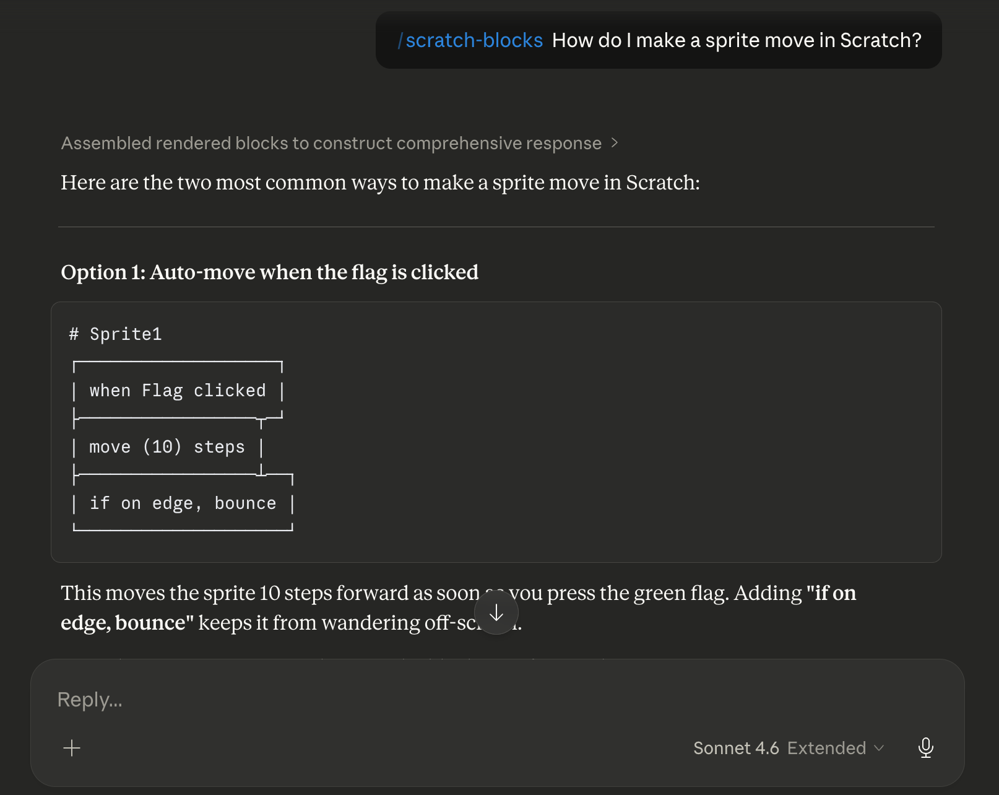
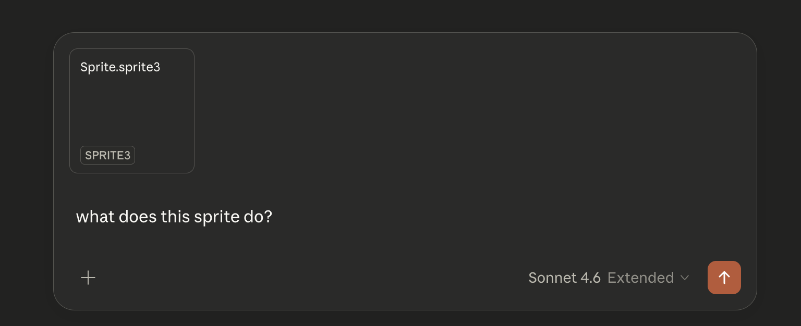

# Scratch Skills

A skill that helps AI read and speak Scratch in a text-friendly format.


## What It Does

```
┌───────────────────┐
│ when Flag clicked │
├────────────┬──────┘
│ repeat (5) │
│ ┌──────────┴─────────┐
│ │ say (Hello World!) │
│ └──────────┬─────────┘
│          ↺ │
└────────────┘
```

Ask any question about a Scratch project.

If you need help debugging, download your project or export a single sprite, then upload it to your AI.





This skill helps the AI:

- read `.sb3` and `.sprite3` files
- render Scratch blocks into a more readable ASCII format

### Note

Your AI might ask for permission to run these two Python scripts:

- `skills/scratch-blocks/scripts/extract.py` to extract project content from `.sb3`, `.sprite3`.

- `skills/scratch-blocks/scripts/render_ascii.py` to render blocks in a more readable format

## Repo Details

This repo defines the `scratch-yaml` format and the scripts, references, and tests that support the Scratch skill.

The extractor writes one combined `.blocks.yaml` file by default, or uses the exact path passed to `--output`.

## What Is Here

- `skills/scratch-blocks/`: the Scratch skill, references, and scripts
- `example/`: small checked-in fixtures and expected extracted output
- `tests/`: pytest coverage for the extractor
- `tools/`: one-off helper scripts and reference data

## Main Scripts

- `skills/scratch-blocks/scripts/extract.py`
  Converts `.sb3`, `.sprite3`, or Scratch JSON into extracted
  `scratch-yaml` and prints the output YAML path.
- `skills/scratch-blocks/scripts/render_ascii.py`
  Renders `scratch-yaml` into a boxed ASCII view for user-facing display.

## Python Setup

This repo is set up for `uv`.

```bash
uv sync --dev
uv run pytest -q
```

## Example

Extract the checked-in example fixture:

```bash
python3 skills/scratch-blocks/scripts/extract.py example/project.json
```

This writes `example/project.blocks.yaml`.

Render the example sprite view:

```bash
python3 skills/scratch-blocks/scripts/render_ascii.py example/sprite.yaml
```
